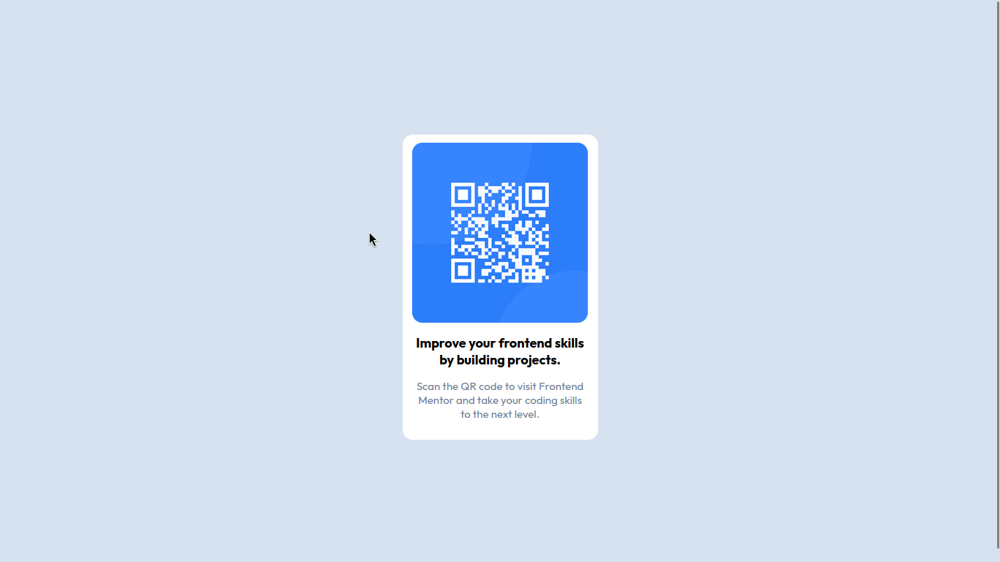
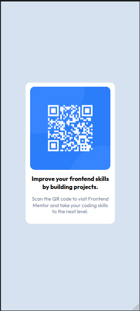

# QR Component Frontend Mentor Challenge

## Table of Contents

- [Introduction](#introduction)
- [Built With](#built-with)
- [What I learned](#what-i-learned)
- [Screenshots](#screenshots)

## Introduction

This is a qr component frontend mentor challenge.\
It is a beginner level challenge.\
Here is the challenge link: [qr-component](https://www.frontendmentor.io/challenges/qr-code-component-iux_sIO_H)\
Here is the live url: [live url](https://qr-code-component-lac-nine.vercel.app/)

## Built with

- HTML
- CSS
- Vite
- NodeJS

## What I learned

- Practiced the basics of `HTML` and `CSS`.
- Learned to use `Semantic HTML`.
- Learned to use `CSS variables`

## Screenshots

- Desktop View

  

- Mobile View

  
